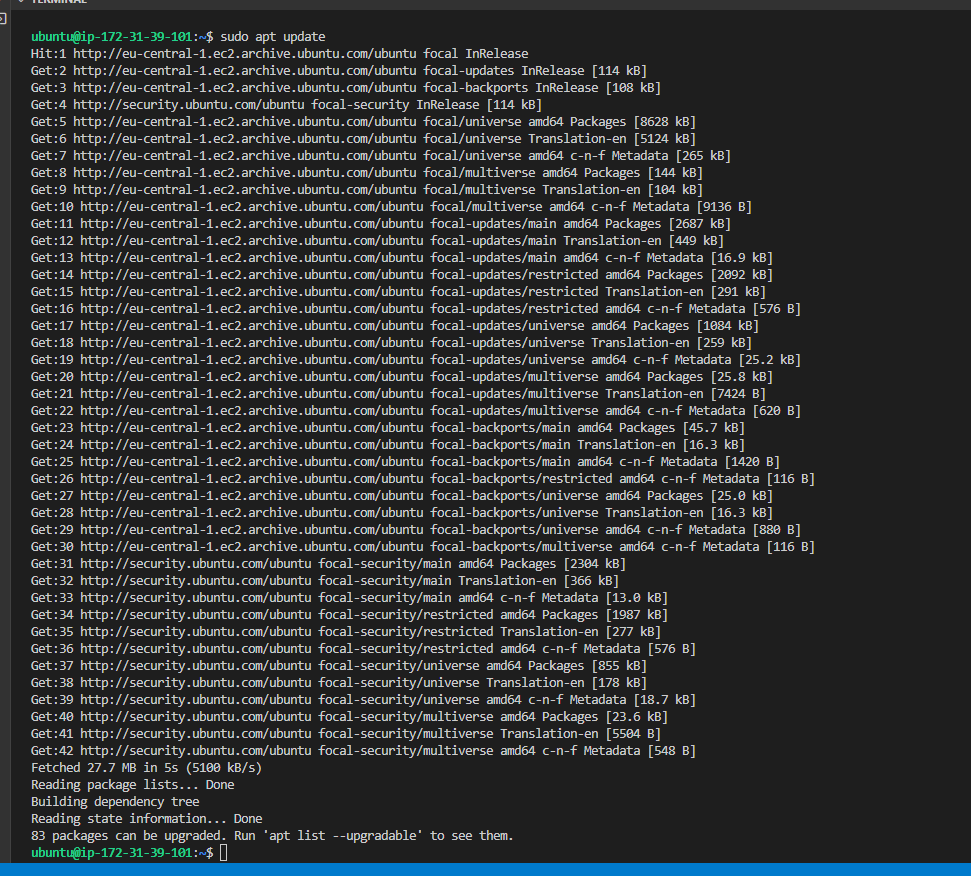
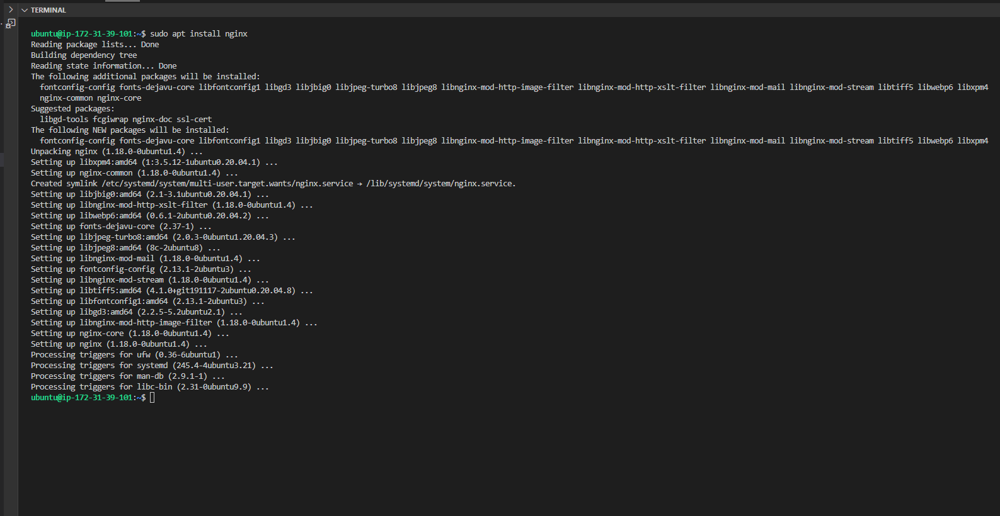
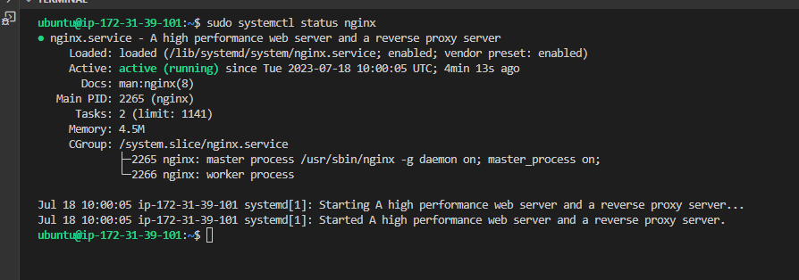
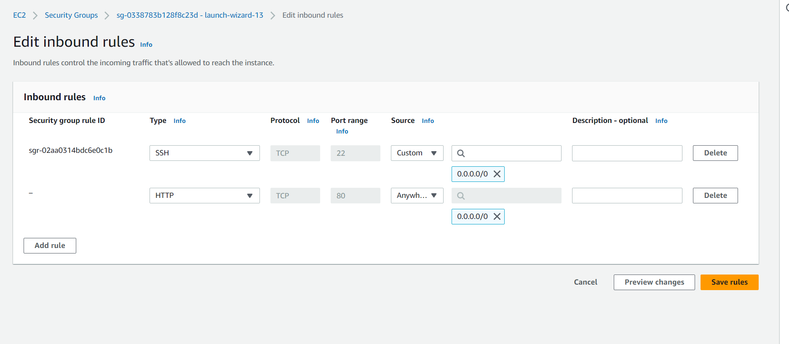
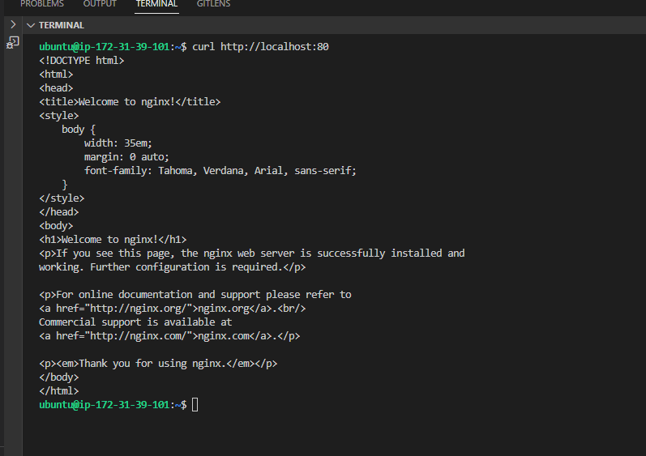
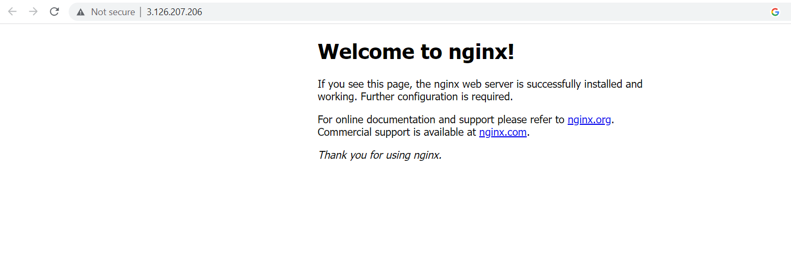

# Project-02-LEMP-stack-implementation

## Installing NGNIX web server

update server package

`sudo apt update`

`sudo apt install nginx`

verify nginx is successfully installed and running

`sudo systemctl status nginx`

edit inbound rules by opening TCP port 80 in Ubuntu instance

Access server locally with curl command

curl http://localhost:80

Test how  the nginx server responds to requests from the internet

[nginx server response from broser](http://3.126.207.206:80)

