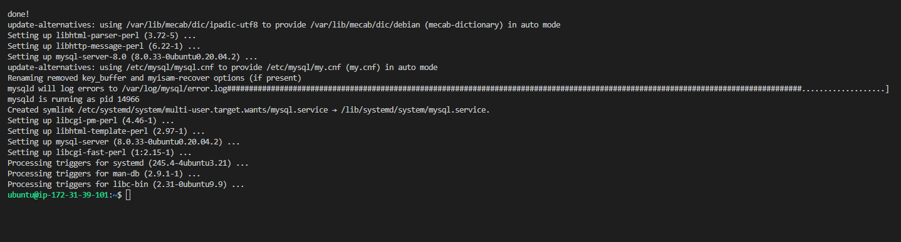
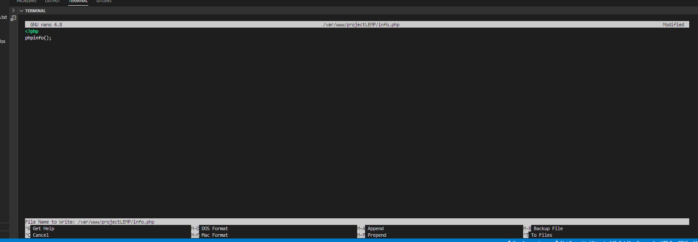
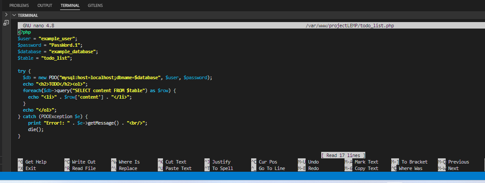

# Project-02-LEMP-stack-implementation

## Installing NGNIX web server

update server package

`sudo apt update`

`sudo apt install nginx`

verify nginx is successfully installed and running

`sudo systemctl status nginx`

edit inbound rules by opening TCP port 80 in Ubuntu instance

Access server locally with curl command

curl http://localhost:80

Test how  the nginx server responds to requests from the internet

[nginx server response from broser](http://3.126.207.206:80)

### Installing MYSQL DBMS

Install mysql-server

`sudo apt install mysql-server`

Log in to mysql console

`sudo mysql`

run a security script that comes pre-installed with MySQL. This script will remove some insecure default settings and lock down access to your database system. Before running the script you will set a password for the root user, using mysql_native_password as default authentication method. We’re defining this user’s password as PassWord.1.

set password for rooy user in mysql console by running the script below

ALTER USER 'root'@'localhost' IDENTIFIED WITH mysql_native_password BY 'PassWord.1';

run interactive script

`sudo_mysql_secure_installation`

test to see if you can log in to MySQL console

`sudo mysql -p`

`exit`

[exiting mysql console](./images/installing_mysql/exiting_mysql_console.png)

INSTALL PHP

install php packages

`sudo apt install php-fpm php-mysql`

check that php has been installed

`php -v`

CONFIGURE NGINX TO USE PHP PROCESSOR

create domain directory (to be called projectLEMP) within server block /vaw/www/html

`sudo mkdir /var/www/projectLEMP`

assign ownership of the directory with the $USER environment variable, which will reference your current system user

`sudo chown -R $USER:$USER /var/www/projectLEMP`

open a new configuration file in Nginx’s sites-available directory using nano editor

`sudo nano /etc/nginx/sites-available/projectLEMP`   

Activate the configuration by linking to the config file from Nginx’s sites-enabled directory

`sudo ln -s /etc/nginx/sites-available/projectLEMP /etc/nginx/sites-enabled/`

test configuration file for syntax errors

`sudo nginx -t`

disable default nginx host that is currently configured to listen on port 80

`sudo unlink /etc/nginx/sites-enabled/default`

reload nginx to apply the changes

`sudo systemctl reload nginx`

the new website is now active, but the web root /var/www/projectLEMP is still empty. Create an index.html file in that location so that we can test that your new server block works as expected

`sudo echo 'Hello LEMP from hostname' $(curl -s http://169.254.169.254/latest/meta-data/public-hostname) 'with public IP' $(curl -s http://169.254.169.254/latest/meta-data/public-ipv4) > /var/www/projectLEMP/index.html`

open url in browser with public IP

access website in browser with public DNS name

TESTING PHP WITH NGINX

create test PHP file

`sudo nano /var/www/projectLEMP/info.php`

access info.php page with browser

after checking information on php in the webpage, remove the info.php filr for security reasons as it containd sensitive information

`sudo rm /var/www/projectLEMP/info.php`

RETRIEVING DATA FROM MYSQL DATABASE WITH PHP

connect to mysql console using the root account and create database (example database)

`sudo mysql -p`

create a new user and grant him  full priviledges on the database created

`CREATE USER 'example_user'@'%' IDENTIFIED WITH mysql_native_password BY 'password';`

give the new user created permission over the example database created (This will give the example_user user full privileges over the example_database database, while preventing this user from creating or modifying other databases on your server.)

`exit`

test if the new user has the proper permissions by logging in to the MySQL console again, this time using the custom user credentials

`mysql -u example_user -p`

confirm access to database

`SHOW DATABASES;`

create test table called todo_list

`CREATE TABLE example_database.todo_list (item_id INT AUTO_INCREMENT,content VARCHAR(255),PRIMARY KEY(item_id));`

Insert a few rows of content in the test table

confirm that the data was successfully saved to the table

`SELECT * FROM example_database.todo_list;`

exit mysql console

`exit`

Now you can create a PHP script that will connect to MySQL and query for your content. Create a new PHP file in your custom web root directory using your preferred editor. We’ll use nano for that

`nano /var/www/projectLEMP/todo_list.php`

access page in web browser

[accessing page in web browser](http://3.126.207.206/todo_list.php)

[todo_list page in web browser](./images/retrieving_data_from_mysql_database_with_php/accessing_todo_list_in_browser.png)

END OF PROJECT!